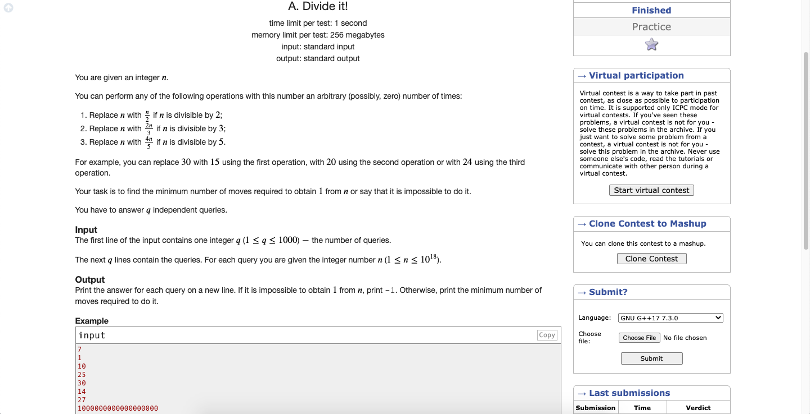

# Codeforces-1176A-Divide-it
### Problem

### Program Simulation
<pre>
  Sample Input: 10
  
  n = 4
  
  while(n % 2 == 0) 
    * First Loop *
      n /= 2 -> 5
      ++cnt2 -> 1
     * End Loop *
  
  * Skip (n % 3 == 0) Loop *
  
  while(n % 5 == 0) 
    * First Loop *
      n /= 5 -> 1
      ++cnt5 -> 1
    * End Loop *
  
  if(n != 1) // false
  else
    print 1 + 0 * 2 + 1 * 3 = 4
  
  Final Output:
  4
  

  Sample Input: 25
  
  n = 25
  
  * Skip (n % 2 == 0) Loop *
  
  * Skip (n % 3 == 0) Loop *
  
  while(n % 5 == 0) 
    * First Loop *
      n /= 5 -> 5
      ++cnt5 -> 1
    * Second Loop *
      n /= 5 -> 1
      ++cnt -> 2
    * End Loop *
  
  if(n != 1) // false
  else
    print 0 + 0 * 2 + 2 * 3 = 6
  
  Final Output:
  6
  

  Sample Input: 30
  
  n = 30
  
  while(n % 2 == 0) 
    * First Loop *
      n /= 2 -> 15
      ++cnt2 -> 1
    * End Loop *
  
  while(n % 3 == 0)
    * First Loop *
      n /= 3 -> 5
      ++cnt3 -> 1
    * End Loop *
  
  while(n % 5 == 0)
    * First Loop *
      n /= 5 -> 1
      ++cnt5 -> 1
    * End Loop *
  
  if(n != 1) // false
  else
    print 1 + 1 * 2 + 1 * 3 = 6
  
  Final Output:
  6
  

  Sample Input: 14
  
  n = 14
  
  while(n % 2 == 0) 
    * First Loop *
      n /= 2 -> 7
      ++cnt2 -> 1;
    * End Loop *
  
  * Skip (n % 3 == 0) Loop *
  
  * Skip (n % 5 == 0) Loop *
  
  if(n != 1) // true
    print -1
    
  Final Output:
  -1
  

  Sample Input: 27
  
  n = 27
  
  * Skip (n % 2 == 0) Loop *
  
  while(n % 3 == 0) 
    * First Loop *
      n /= 3 -> 9
      ++cnt3 -> 1
    * Second Loop *
      n /= 3 -> 3
      ++cnt3 -> 2
    * Third Loop *
      n /= 3 -> 1
      ++cnt3 -> 3
  
  if(n != 1) // false
  else
    print 0 + 3 * 2 + 0 * 3 = 6
  
  Final Output:
  6
